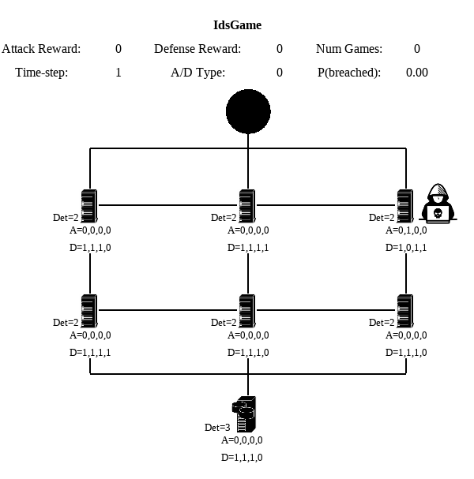

# `gym-idsgame` An Abstract Cyber Security Simulation and Markov Game for OpenAI Gym

Ce projet découle du projet du Github suivant https://github.com/Limmen/gym-idsgame. Je vous invite à lire le ReadMe de ce github afin de mieux comprendre le contexte de cette simulation.  
La contribution de ce github par rapport au github précédent est l'implémentation d'attaques de cybersécurité tel que le craquage de mot de passe, de la stéganographie et du craquage de hash ou l'injection de fichier dans un serveur.

Les entraînements et simulations sont présents dans le dossier simulation et chaque attaque de cybersécurité est détaillé précisément à l'aide d'un Notebook et d'un Readme dans le dossier gym-idsgame/cyber/test.  
L'intérêt de ce projet est de combiner de manière pertinente la cybersécurité et l'intelligence artificielle.   

<p align="center">

</p>

Sommaire
=================

   * [Requirements](#Requirements)
   * [Installation](#Installation)
   * [Usage](#Usage)
   * [Future Work](#Future-Work)


## Requirements

Ce projet a été réalisé avec un environnement Linux et plus précisément avec une distribution Kali Linux. Il peut être plus aisé de réaliser l'installation sur une distribution similaire.  


- Python 3.5+
- OpenAI Gym
- NumPy
- Piexiftool
- Piexif
- Stepic
- Pyglet (OpenGL 3D graphics)
- GPU for 3D graphics acceleration (optional)
- jsonpickle (for configuration files)
- torch (for baseline algorithms)
- John the Ripper (for hashing)


## Installation & Tests

```bash
# git clone and install from source
git clone https://github.com/lrakotoarivony/gym-idsgame
cd gym-idsgame
pip install -e .
```

## Usage

Voir le dossier simulation

## Future Work

Les pistes suivantes n'ont pas été exploré par manque de temps. Il peut être intéressant de les étudier par le futur pour améliorer la simulation.  

- Optimisation des entraînements via de la recherche sur hyperparamètres
- Confronter les différents algorithmes afin d'opposer les stratégies et trouver la stratégie optimale
- Modifier l'environnement et étudier son influence
- Rajouter des attaques de cybersécurité (IP Spoofing via Scapy, obfuscation, phising via mail, etc...)
