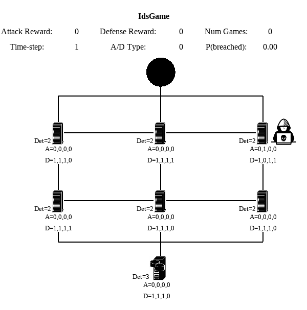

# Experiment `Cybersecurity` v0

Cela est le dossier permettant les expériences sur l'environnement `idsgame-cyber-v0`.  
Cet environnement est dédié à des simulations à 1 ou 2 agents ou des entrainements de RL.

La configuration de l'environnement est la suivante:  

- `num_layers=2` (number of layers between the start and end nodes)
- `num_servers_per_layer=3`
- `num_attack_types=4`
- `max_value=3`  
- `connected_layers = True`

Les attaques types sont les suivantes (cf dossier cyber pour plus d'infos) 
- attaque par injection de fichier  
- déchiffrage d'un hash  
- attaque sur mdp  
- détection de stégano dans une image  

<p align="center">

</p>

L'environnement de départ est initialisé de manière définie (introduire de l'aléatoire dans le placement des vulnérabilités n'est pas souhaitable car les attaques ne sont pas transposables).  

- `defense_val=1`
- `attack_val=0`
- `num_vulnerabilities_per_node=1`  
- `det_val=2`
- `vulnerability_val=0`
- `num_vulnerabilities_per_layer=2` 

L'environnement a des rewards discrètes (+1,-1 en fonction de la fin de chaque épisode).

## Environment 

- Env: `idsgame-cyber-v0`

## Algorithm

- Tabular Q-learning ou DQN
 
## Commands

Le script permettant l'entraînement est le script training.py.  
Voici un exemple d'utilisation ainsi que ses arguments

```
python training.py --num_episodes 100 --checkpoint_freq 10 --dqn --attacker_only
```

Ce script contient plusieurs arguments:  

- num_episodes : nombres d'epoch d'entrainements
- checkpoint_freq :  la fréquence de sauvegarde et d'évaluation
- dqn : si dqn ou tabular learning
- attacker_only : seulement entrainement de l'attaquant
- defender_only : seulement entrainement du défenseur  

Le script permettant les simulations avec les algorithmes de tabular learning est le script simulation_tabular.py  
Voici un exemple d'utilisation ainsi que ses arguments

```
python training.py --num_episodes 100 --attacker_path path/to/attacker/npy --defender_path path/to/defender/npy
```

Ce script contient plusieurs arguments:  

- num_episodes : nombres de simulations
- attacker_path : chemin vers un fichier npy de l'attaquant  
- defender_path : chemin vers un fichier npy du défenseur
- attacker_bot : vrai si l'attaquant utilise la tactique AMV
- defender_bot : vrai si le défenseur utilise la tactique DMV


Le script permettant les simulations avec les algorithmes de DQN est le script simulation_dqn.py.  
Voici un exemple d'utilisation ainsi que ses arguments

```
python training.py --num_episodes 100 --attacker_path path/to/attacker/pt --defender_path path/to/defender/pt
```

Ce script contient plusieurs arguments:  

- num_episodes : nombres de simulations
- attacker_path : chemin vers un fichier pt de l'attaquant  
- defender_path : chemin vers un fichier pt du défenseur


## Analyse et test  

Cette simulation diffère de la simulation originale sur plusieurs points. Tout d'abord, contrairement à la version originelle chaque attaque possède des probabilités de succès différentes (voir dossier cyber dans l'env gym-idsgame). Cela a pour effet d'introduire de l'aléatoire et ainsi de créer des stratégies complexe qui dépendent des choix des algorithmes.   
Une version antérieure des attaques par stéganographie avait pour résultat que l'attaquant pouvait en augmentant au maximum son niveau d'attaque sur l'attaque de stéganographie obtenir une probabilité de succès de l'attaque de 100%. Cela représente une stratégie gagnante et les modèles d'attaquant que entrainé dans cette situation tendait vers cette stratégie. Cela démontre que les algorithmes réussisent à trouver une stratégie gagnante si elle est simple. Cependant, dans ce cas, le défenseur faisait des actions randoms car peu importe ses mouvements cela menaient à une défaite. La simulation fut donc changé pour rendre cela plus réaliste.  

Un travail a également été fait sur l'environnement afin que cela soit équilibré pour l'attaquant et le défenseur. Nous allons introduire une metric nommé la hack probability, cette metric représente le pourcentage de victoire de l'attaquant. On comprend aisément que le but de l'attaquant est de maximiser cette metric et inversement pour le défenseur.  
L'environnement a donc été testé via des modifications et actuellement en opposant l'attaque Attack Maximal Value (AMV) et la défense Defend Minimal Value (DMV), on obtient une hack probability de 0.55. Cela laisse une marge de progression intéressante pour l'attaquant et le défenseur.  

### Méthodes par apprentissage vs méthodes définies:  

Dans un premier temps, nous souhaitons démontrer que les méthodes par apprentissage peuvent facilement dans cette simulation, obtenir de meilleures performances que des méthodes définies comme AMV ou DMV. Pour cela, nous avons entrainé 2 modèles de tabular q learning (présent dans le dossier modèle sous le nom d'attacker_only_new_env.npy (respectivement defender_only_new_env.npy)) sur 20001 épisodes face à DMV (respectivement AMV). Nous avons ensuite calculé la hack probability de ces confrontations.  

On obtient donc en résultat:  
- AMV vs DMV : 0.55
- Tabular Q Learning vs DMV : 0.63
- AMV vs Tabular Q Learning : 0.53

Cela démontre que les méthodes par apprentissage obtiennent de meilleurs résultats. En effet, cela s'explique car les méthodes AMV et DMV sont très pertinente dans la simulation de base car chaque attaque se comporte de la même manière. Dans notre simulation, où les attaques sont différentes il est par exemple inutile d'investir des ressources dans les attaques par stéganographie (comportement statique avec toujours 33% de chance de passer peu importe les niveaux.  

### Comparaison des méthodes d'apprentissage:  

Dans cette partie, nous allons nous intéresser aux deux simulations suivantes. La première opposera 2 algorithmes de tabular learning et la deuxième 2 algorithmes de type DQN. A savoir que chaque paire d'attaquant et de défenseur se sont entrainés simultanément sur 20000 épisodes et que l'on va maintenant s'intéresser à leur confrontation sur 100 confrontations.  
L'environnement est toujours le même que dans les expériences précédentes. Il est important de préciser que nous n'avons pas effectué d'optimisation sur les hyperparamètres donc il est fort probable que les modèles ne soient pas optimaux.

#### Tabular Q Learning vs Tabular Q Learning  

Les 2 modèles ayant permis cette simulation sont disponible dans le dossier model sous le nom attacker_tabular.npy et defender_tabular.npy. Ces 2 modèles se sont affrontés sur 100 épisodes et on obtient une hack probability de 0.2. Cela démontre que le défenseur devient vraiment performant dans cette configuration.  

On observe tout d'abord que l'attaquant choisit de concentrer ses attaques sur le coté droit de l'environnement, cela est peut être du au fait que la plupart des vulnérabilités sont majoritairement présentes sur le coté droit et le milieu de la simulation.  
On remarque ensuite que l'attaquant choisit systématiquement comme cible d'attaque les valeurs correspondant soit à l'injection de fichier, soit à l'attaque par hashing. Cela se comprend aisément car ce sont les 2 attaques où l'attaquant peut obtenir un pourcentage élevé de succès. En effet, l'attaque sur MDP a très souvent des probabilités faibles de succès et l'attaque par stéganographie aura toujours 33% de chance de succès ce qui est assez faible.  
On remarque finalement que l'attaquant effectue une sorte de zigzag, ce comportement n'a pas trouvé d'explication il pourrait être intéressant de s'y intéresser pour le futur.  

Le défenseur quant à lui effectue toujours la même action au départ. Il augmente au maximum le niveau de détection sur le noeud Server ce qui indique qu'il comprend l'importance de ce noeud.  
On remarque également qu'il n'augmente jamais les valeurs de défense sur le vecteur de type stéganographie car cela n'aura aucun effet sur le déroulement de l'attaque.  
Enfin, on remarque qu'il choisit de concentrer sa défense sur le coté droit de la simulation, il n'est pas vérifié si cela est à cause du nombre de vulnérabilités ou si car l'attaquant choisit souvent de passer par là.  

#### DQN vs DQN  

Les 2 modèles ayant permis cette simulation sont disponible dans le dossier model sous le nom attacker_dqn.pt et defender_dqn.pt. Ces 2 modèles se sont affrontés sur 100 épisodes et on obtient une hack probability de 0.22. Cela démontre que le défenseur devient vraiment performant dans cette configuration comme dans l'expérience précédente. De plus, cela prouve bien que le défenseur a clairement l'avantage dans cette simulation.  

Concernant l'attaquant, on retrouve beaucoup de similarités dans le comportement du DQN Attaquant et du Tabular Q Learning Attaquant, en effet ces deux algorithmes effectuent le même mouvement de zigzag pour se déplacer, privilégient le coté droit et attaquent sur les mêmes failles.  

Le défenseur quant à lui commence également comme le Tabular Q Learning défenseur en augmentant la détection sur le noeud Server. Par la suite, leur stratégie diverge car le DQN choisit de parcourir l'environnement et d'augmenter le niveau de détection pour ensuite augmenter le niveau de sécurité. On remarque que cette fois, le défenseur parcours tout le modèle et ne se concentre pas uniquement sur le coté droit de l'environnement.
